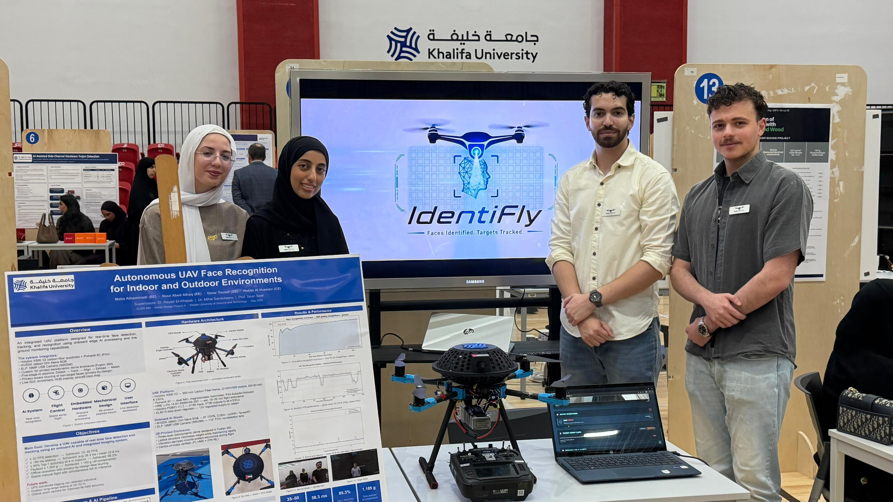
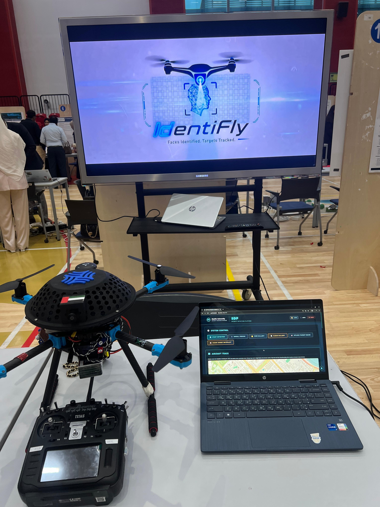
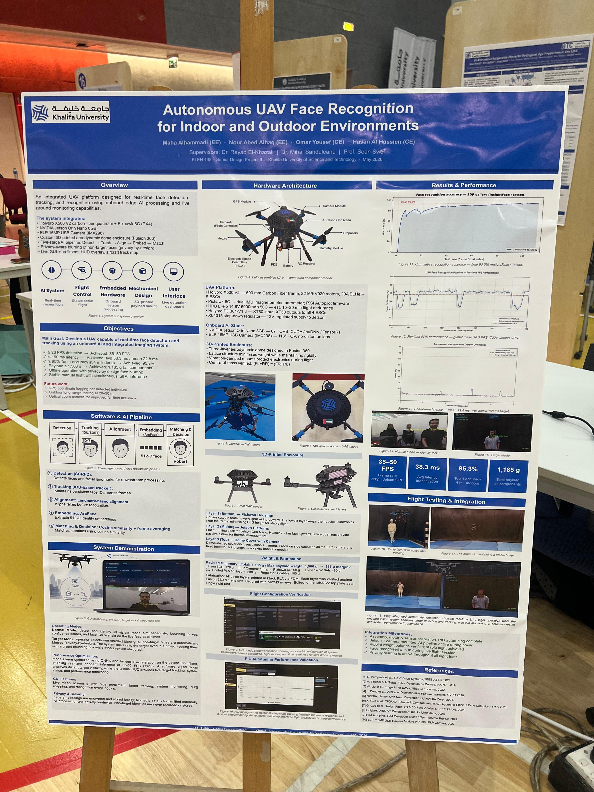
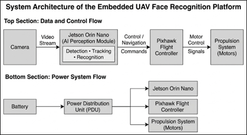
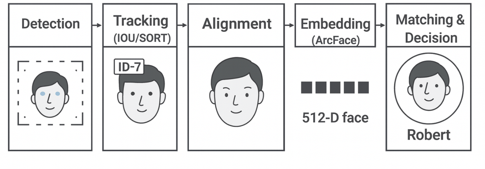

# Autonomous UAV Face Recognition System

Real-time UAV-based face recognition platform using embedded AI on NVIDIA Jetson Orin Nano.

<p align="center">
  
</p>

---

# Overview

This project implements a fully onboard real-time face recognition system deployed on a UAV platform for indoor and outdoor environments.

The system integrates:

- SCRFD face detection
- ArcFace face recognition
- Real-time target tracking
- Embedded GPU inference
- Live GUI visualization
- Privacy-aware face blurring
- Digital zoom
- UAV hardware integration

All AI inference runs directly onboard the UAV without cloud dependency.

---

# Demo Videos

## Real-Time Drone Face Detection

[](https://youtu.be/_6pe3W24RDw?si=Cl7_Z-nmFUFf8IxO)

---

## User Interface Demonstration

[](https://youtu.be/1MUbnvdHDAI?si=b8AuqsP6veV_q9dv)

---

# Live System Demonstration

## UAV Hardware Integration

<p align="center">
  
</p>

---

## Project Poster

<p align="center">
  
</p>

---

# System Architecture

<p align="center">
  
</p>
<br>

---

# AI Pipeline

<p align="center">
  
</p>

The onboard AI pipeline consists of:

1. Face Detection using SCRFD
2. Face Tracking
3. Face Alignment
4. ArcFace Embedding Extraction
5. Cosine Similarity Matching

---

# Hardware Platform

- NVIDIA Jetson Orin Nano
- Holybro X500 V2 UAV
- Pixhawk 6C
- ELP 16MP USB Camera
- LiPo Battery Power System

---

# Features

- Real-time onboard inference
- 35-50 FPS embedded performance
- Live GUI visualization
- Face enrollment system
- Embedded GPU acceleration
- Privacy-aware face blurring
- Digital zoom support

---

# Results

| Metric | Result |
|---|---|
| FPS Performance | 35-50 FPS |
| AI Inference | Fully onboard |
| Processing Platform | Jetson Orin Nano |
| Detection Pipeline | SCRFD + ArcFace |
| Flight Mode | Manual stabilized flight |
| Privacy Features | Face blurring supported |

---

# Technologies Used

## AI & Vision

- Python
- OpenCV
- PyTorch
- SCRFD
- ArcFace

## Embedded & Systems

- Jetson Orin Nano
- CUDA
- TensorRT
- Linux

## UAV Platform

- Pixhawk
- MAVLink
- QGroundControl

---

# Future Work

- Autonomous navigation
- MAVLink-based AI flight control
- Multi-target tracking
- GPS-denied navigation
- SLAM integration

---

# Documentation

Full project report available in:

```text
docs/
```

---

# Authors

Hasan Al Hussein  
Khalifa University
